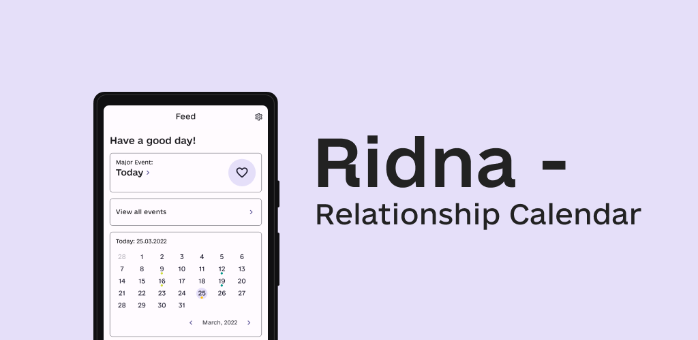

# Ridna App

[](#)
[](#)



> 😖 This application was created for training purposes and may use an incorrect implementation.

## Information

Calendar app for couples 💞 
> 
You can download this app by following [this link](https://play.google.com/store/apps/details?id=com.ribsky.ridna)

<a href='https://play.google.com/store/apps/details?id=com.ribsky.ridna&pcampaignid=pcampaignidMKT-Other-global-all-co-prtnr-py-PartBadge-Mar2515-1'></a>

## Stack/Libraries

### 1. Stack

- Kotlin
- Material Design You with Dynamic Color
- MVVM
- Clean Architecture
- Android Architecture Components
- Navigation component
- Lifecycle
- LiveData
- Room
- Coroutines
- Jetpack
- ViewBinding
- Localization

### 2. Libraries

- [ViewBindingPropertyDelegate](https://github.com/kirich1409/ViewBindingPropertyDelegate)
- [Insetter](https://github.com/chrisbanes/insetter)
- [Koin](https://github.com/InsertKoinIO/koin)
- [CircleIndicator](https://github.com/ongakuer/CircleIndicator)
- [Tempo](https://github.com/cesarferreira/tempo)
- [Glide](https://github.com/bumptech/glide)
- [Moshi](https://github.com/square/moshi)
- [Localization](https://github.com/akexorcist/Localization)

### 3. Other

- Splashscreen
- Flexbox
- Palette

## Author.

- GitHub: [@nexy791](https://github.com/nexy791)
- License: Apache-2.0 License

```

Copyright 2022 Aleander Nexy

Licensed under the Apache License, Version 2.0 (the "License");
you may not use this file except in compliance with the License.
You may obtain a copy of the License at

<http://www.apache.org/licenses/LICENSE-2.0>

Unless required by applicable law or agreed to in writing, software
distributed under the License is distributed on an "AS IS" BASIS,
WITHOUT WARRANTIES OR CONDITIONS OF ANY KIND, either express or implied.
See the License for the specific language governing permissions and
limitations under the License.

```
